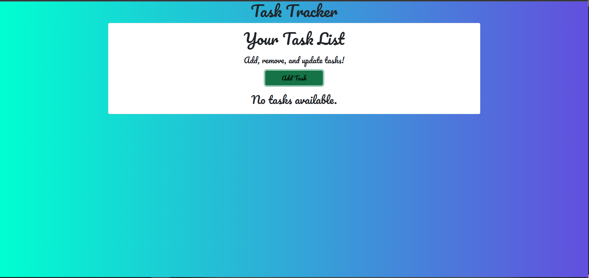
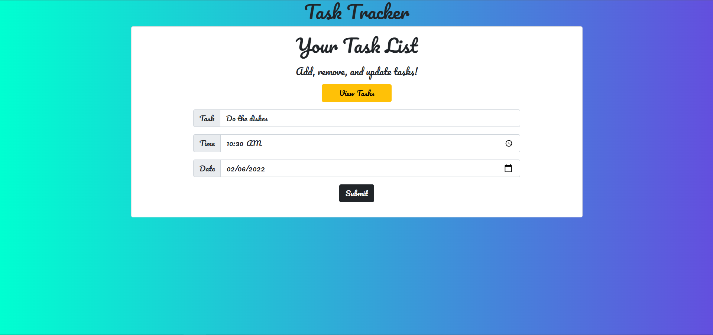
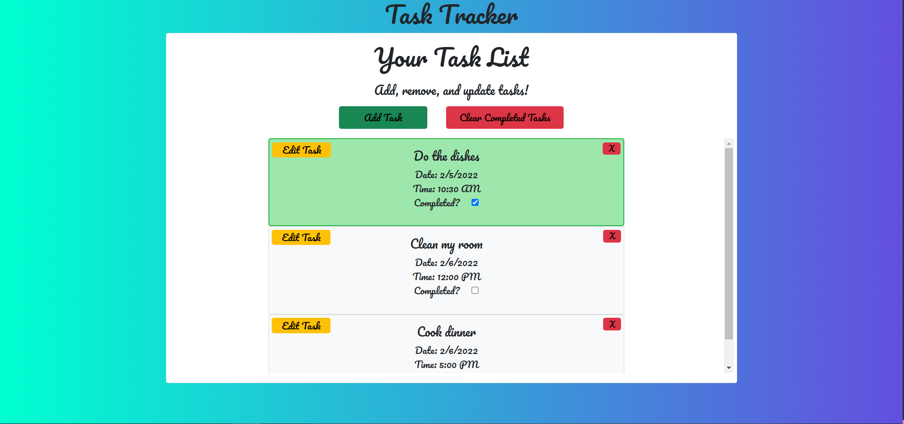

# Task-Tracker 🖊️✅

A React.js app that tracks a user's planned tasks using IndexedDB and Dexie.

## Link to Deployed Application

 _**https://dreamy-fermat-7e9bea.netlify.app/**_

## Table of Contents

1. [User Story](#user-story)
2. [What to Expect](#what-to-expect)
3. [Project Description](#project-description)
4. [Instructions for Use](#instructions-for-use)
5. [Tech Stack](#tech-stack)
6. [Goals for Deployment](#goals-for-deployment)
7. [Screenshots](#screenshots)

## User Story

_As an individual who has a busy lifestyle_

_I want to set a task list_

_So that I can track my current short term tasks_

## What to Expect

This app is directed towards individuals with a busy lifestyle. The user can add a number of tasks to the list and always come back to the app to add, update, or remove tasks. Each task can conveniently be marked as complete and removed from the list in one swift click! This app is persistent, meaning that the tasks will always be there on your local computer.

**Important! If you clear your browser history, your tasks will be cleared as well!**
## Project Description

Task Tracker is an app built off of React.js, using Create-React-App to generate the folder structure. Data input by the user is stored locally using IndexedDB. Dexie with React Hooks was installed on this project to interact with IndexedDB seamlessly. React-Bootstrap was used for bringing in Bootstrap components for styling and page responsiveness.

## Instructions for Use

To use the Task Tracker, you simply have to click the link above in the _Link to Deployed Application_ section. You will be directed right to the application, where you can start adding tasks today!

It is important to note that since this data is stored locally on your device, these tasks do not transfer over to other computers. Without the use of credentials, IndexedDB ensures that your data does not carry over to any other users or machines, while allowing your data to be persistent upon return.

**Important! If you clear your browser history, your tasks will be cleared as well!**

## Tech Stack

* React.js
* Node.js
* React-Bootstrap
* IndexedDB
* Dexie.js

## Goals for Deployment

- [x] User will be presented with existing tasks if available
- [x] User will be able to open a form upon clicking an "Add Form" button
- [x] User will be able to edit/delete tasks
- [x] Tasks will be sorted by date
- [x] Tasks will be stored locally on the user's machine

## Screenshots

